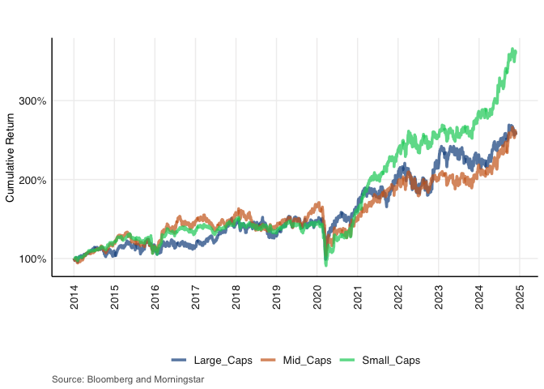
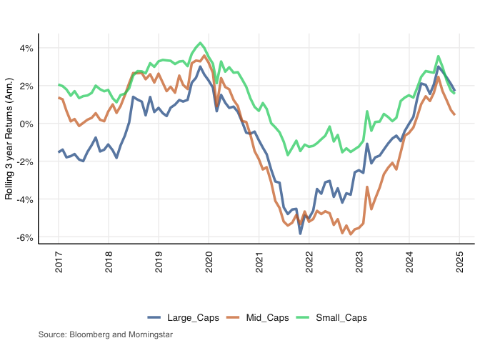
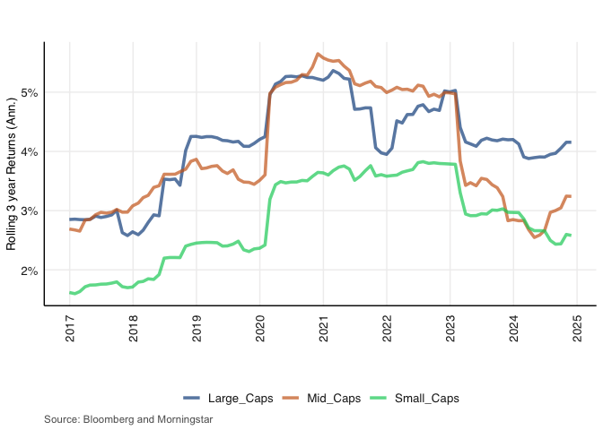

README
================
HL VAN ZYL 17640296
2025-01-31

# Introduction

This is the README for my financial econometrics 871 project. The
primary idea for this project is to compare volatility across market cap
sizes. The approach I have decided upon is to decompose the ALSI into
three constituent indices each representing different level of market
capitalisation and then to compare these indices across various
volatility and other statistical measures to gain insight regarding
their relative stability in the South African context.

I hope to incorporate the following in my project:

Minimum: -Rolling volatility and return plots -A table containing
volatility metrics (RV, Sharpe, maxdrawn downs, tail risks, etc.)

If I have enough time: -Stratify over periods of higher USD/ZAR
volatility -Garch model for conditional volatility

These should provide sufficient evidence to make some inferences
regarding the stability of low cap versus mid and large cap stocks in
South Africa.

# Data wrangling

Load packages

``` r
pacman::p_load(tidyverse, here, magrittr, tbl2xts, fmxdat, zoo, PerformanceAnalytics, gt)
```

The data in its raw format has a returns series and also the weights for
the ALSI and capped SWIX. For the purposes of this analysis I will be
focussing on capped SWIX. Initial data wrangling just cleans the
dataframe a bit and removes tickers with more than 3 characters (these
don’t appear to be legitimate stocks). Impute weights with zeroes where
observations are NA.

``` r
df_raw <- readRDS("data/LCL_Stock_Returns.rds") %>% 
  mutate(Tickers = gsub(" SJ Equity", "", Tickers)) %>% 
  rename(Sector = Superindustryname_Pty) %>% 
  arrange(date) %>% 
  rename("ALSI" = "J203", "SWIX"= "J433") %>% 
    select(-VWAP_TO)

# Find tickers with more than 3 characters 
tickers_longer_than_3 <- df_raw %>%
  filter(nchar(Tickers) > 3) %>%
  distinct(Tickers) %>% 
  pull()
# these don't look legit, remove


# use this one for benchmark returns 
# i'm including this  after having done the rest of the project because I thought i
# it might make more sense to have the original ALSI as a benchmark for comparison
# this turned out to be a bad idea ; the values are very close to Large_caps so not 
# very informative and they obscure the other results in the plots
ALSI_bm <- df_raw %>% 
    filter(!Tickers %in% tickers_longer_than_3) %>% 
    mutate(ALSI = coalesce(ALSI,0)) %>% 
    filter(!is.na(Index_Name)) %>% 
    filter(date > lubridate::ymd(20131231)) %>%
    group_by(Tickers, date) %>% 
          mutate(Return = ifelse(is.na(Return),
                         0,
                         Return)) %>% 
    group_by(date) %>% 
    mutate(reweight = ALSI/sum(ALSI)) %>% 
    ungroup()

    


# use this one for market cap return cals
df_raw2 <- df_raw %>% 
    filter(!Tickers %in% tickers_longer_than_3) %>% 
    mutate(ALSI = coalesce(ALSI,0)) %>% 
    filter(!is.na(Index_Name)) %>% 
    select(-SWIX)
```

This next part is a bit tricky. I want to use safe portfolio returns on
each Index_Name (market cap size). I create the
`calculate_index_returns` to handle this more elegantly and safely via
the Safe_Return.portfolio function

``` r
# import function

source("code/calculate_index_returns.R")

# use function on different mcap sizes

alsi_small <- calculate_index_returns(data = df_raw2, index_name = "Small_Caps", fund_name = "ALSI") %>% 
    rename("Small_Caps"="PortfolioReturn")

alsi_mid <- calculate_index_returns(data = df_raw2, index_name = "Mid_Caps", fund_name = "ALSI") %>% 
    rename("Mid_Caps"="PortfolioReturn")

alsi_large <- calculate_index_returns(data = df_raw2, index_name = "Large_Caps", fund_name = "ALSI") %>% 
    rename("Large_Caps"="PortfolioReturn")

# SWIX ... maybe later

# get them into 1 df

ALSI_returns <- 
    left_join(alsi_small, alsi_mid, by = "date") %>% 
    left_join(., alsi_large, by = "date") %>% 
    # left_join(., ALSI_BM, by = "date") %>%  I'm removing the ALSI benchmark because it obscures the other lines in the plots
    pivot_longer(-date, names_to = "Market_cap", values_to = "Return") %>% 
    filter(date> lubridate::ymd(20131231))

# not sure if it is due to a mistake in my returns calculation or just the nature of the data but pre-2014 data is unusable now; too many dates have been dropped, there are gaps of over 2 months at a time without observations, thus only data starting 2014 will be used for this analysis. 
```

# Rolling plots

Cumulative

``` r
cumrets <- ALSI_returns %>%
        group_by(Market_cap) %>% 
        mutate(CumReturn = cumprod(1 + Return)) %>% 
        mutate(CumReturn = CumReturn / first(CumReturn)) %>% 
    ungroup()

f <- cumrets %>%  ggplot() + geom_line(aes(date, CumReturn, color = Market_cap),
    alpha = 0.7, size = 1.25) + labs(title = "",
    subtitle = "", x = "", y = "Cumulative Return",
    caption = "Source: Bloomberg and Morningstar") + theme_fmx(title.size = ggpts(30),
    subtitle.size = ggpts(5), caption.size = ggpts(25), CustomCaption = T) +
    fmx_cols()
```

    ## Warning: Using `size` aesthetic for lines was deprecated in ggplot2 3.4.0.
    ## ℹ Please use `linewidth` instead.
    ## This warning is displayed once every 8 hours.
    ## Call `lifecycle::last_lifecycle_warnings()` to see where this warning was
    ## generated.

    ## Warning in loadfonts_win(quiet = quiet): OS is not Windows. No fonts registered
    ## with windowsFonts().

``` r
cum_plot <- finplot(f, x.date.dist = "1 year", x.date.type = "%Y", x.vert = T,
    y.pct = T, y.pct_acc = 1)
    
    
 #Save the plot as a PDF file
# ggsave(
#   filename = here("plots/cum_plot.pdf"), # Replace with your desired folder and file name
#   plot = cum_plot, # The name of your ggplot object
#   device = "pdf",    # The file format
#   width = 7,         # Adjust the width (in inches)
#   height = 4,        # Adjust the height (in inches)
#   units = "in",      # Units for the dimensions
#   dpi = 300          # Dots per inch for high resolution
# )

cum_plot
```

<!-- -->

rolling returns

``` r
plotdf <-
ALSI_returns%>%
        mutate(YM = format(date, "%Y%B")) %>%
    arrange(date) %>%
    group_by(Market_cap, YM) %>%
    filter(date == last(date)) %>%
    group_by(Market_cap) %>%
    # Epic sorcery:
mutate(RollRets = RcppRoll::roll_prod(1 + Return, 36, fill = NA,
    align = "right")^(12/36) - 1) %>%
    # Note this cool trick: it removes dates that have no
    # RollRets at all.
group_by(date) %>%
    filter(any(!is.na(RollRets))) %>%
    ungroup()

g <-
plotdf %>%
    ggplot() + geom_line(aes(date, RollRets, color = Market_cap),
    alpha = 0.7, size = 1.25) + labs(title = "",
    subtitle = "", x = "", y = "Rolling 3 year Returns (Ann.)",
    caption = "Source: Bloomberg and Morningstar") + theme_fmx(title.size = ggpts(30),
    subtitle.size = ggpts(5), caption.size = ggpts(25), CustomCaption = T) +
    fmx_cols()
```

    ## Warning in loadfonts_win(quiet = quiet): OS is not Windows. No fonts registered
    ## with windowsFonts().

``` r
ret_plot <- finplot(g, x.date.dist = "1 year", x.date.type = "%Y", x.vert = T,
    y.pct = T, y.pct_acc = 1)


#Save the plot as a PDF file
# ggsave(
#   filename = here("plots/ret_plot.pdf"), # Replace with your desired folder and file name
#   plot = ret_plot, # The name of your ggplot object
#   device = "pdf",    # The file format
#   width = 7,         # Adjust the width (in inches)
#   height = 4,        # Adjust the height (in inches)
#   units = "in",      # Units for the dimensions
#   dpi = 300          # Dots per inch for high resolution
# )

ret_plot
```

<!-- -->

rolling sd

``` r
plot_sd <- ALSI_returns %>%
    mutate(YM = format(date, "%Y%B")) %>%
    arrange(date) %>%
    group_by(Market_cap, YM) %>%
    filter(date == last(date)) %>%
    group_by(Market_cap) %>%
    # Rolling SD annualized calc now:
mutate(RollSD = RcppRoll::roll_sd(1 + Return, 36, fill = NA, align = "right") *
    sqrt(12)) %>%
    filter(!is.na(RollSD))


h <- plot_sd %>%
    ggplot() + geom_line(aes(date, RollSD, color = Market_cap),
    alpha = 0.7, size = 1.25) + labs(title = "",
    subtitle = "", x = "", y = "Rolling 3 year Returns (Ann.)",
    caption = "Source: Bloomberg and Morningstar") + theme_fmx(title.size = ggpts(30),
    subtitle.size = ggpts(5), caption.size = ggpts(25), CustomCaption = T) +
    fmx_cols()
```

    ## Warning in loadfonts_win(quiet = quiet): OS is not Windows. No fonts registered
    ## with windowsFonts().

``` r
sd_plot <- finplot(h, x.date.dist = "1 year", x.date.type = "%Y", x.vert = T,
    y.pct = T, y.pct_acc = 1)

#Save the plot as a PDF file
# ggsave(
#   filename = here("plots/sd_plot.pdf"), # Replace with your desired folder and file name
#   plot = sd_plot, # The name of your ggplot object
#   device = "pdf",    # The file format
#   width = 7,         # Adjust the width (in inches)
#   height = 4,        # Adjust the height (in inches)
#   units = "in",      # Units for the dimensions
#   dpi = 300          # Dots per inch for high resolution
# )

sd_plot
```

<!-- -->

# Comparison tables

Let’s first try the Downside risk package

``` r
wide_xts <- ALSI_returns %>% 
    pivot_wider(., names_from = Market_cap, values_from = Return) %>% tbl2xts::tbl_xts()

tabdownside <-
  table.DownsideRisk(wide_xts, 
                     ci = 0.95, Rf=0, MAR=0)
# Suppose I am only interested in specific elements of the table, then use:
tabdownside <- tabdownside[c(1,5,7,8:11),]
 

gt_tab <- tabdownside %>% data.frame() %>% tibble::rownames_to_column() %>% 
gt() %>% 
        tab_header(title = glue::glue("Downside Risk estimates")) %>% 
      fmt_percent(
      columns = 2:3,
      decimals = 2
    )
#gtsave(gt_tab, here("tables/gt_tab.png"))

#saveRDS(gt_tab, "bin/gt_tab.rds")

gt_tab
```

<div id="tuyiubuzmu" style="padding-left:0px;padding-right:0px;padding-top:10px;padding-bottom:10px;overflow-x:auto;overflow-y:auto;width:auto;height:auto;">
<style>#tuyiubuzmu table {
  font-family: system-ui, 'Segoe UI', Roboto, Helvetica, Arial, sans-serif, 'Apple Color Emoji', 'Segoe UI Emoji', 'Segoe UI Symbol', 'Noto Color Emoji';
  -webkit-font-smoothing: antialiased;
  -moz-osx-font-smoothing: grayscale;
}
&#10;#tuyiubuzmu thead, #tuyiubuzmu tbody, #tuyiubuzmu tfoot, #tuyiubuzmu tr, #tuyiubuzmu td, #tuyiubuzmu th {
  border-style: none;
}
&#10;#tuyiubuzmu p {
  margin: 0;
  padding: 0;
}
&#10;#tuyiubuzmu .gt_table {
  display: table;
  border-collapse: collapse;
  line-height: normal;
  margin-left: auto;
  margin-right: auto;
  color: #333333;
  font-size: 16px;
  font-weight: normal;
  font-style: normal;
  background-color: #FFFFFF;
  width: auto;
  border-top-style: solid;
  border-top-width: 2px;
  border-top-color: #A8A8A8;
  border-right-style: none;
  border-right-width: 2px;
  border-right-color: #D3D3D3;
  border-bottom-style: solid;
  border-bottom-width: 2px;
  border-bottom-color: #A8A8A8;
  border-left-style: none;
  border-left-width: 2px;
  border-left-color: #D3D3D3;
}
&#10;#tuyiubuzmu .gt_caption {
  padding-top: 4px;
  padding-bottom: 4px;
}
&#10;#tuyiubuzmu .gt_title {
  color: #333333;
  font-size: 125%;
  font-weight: initial;
  padding-top: 4px;
  padding-bottom: 4px;
  padding-left: 5px;
  padding-right: 5px;
  border-bottom-color: #FFFFFF;
  border-bottom-width: 0;
}
&#10;#tuyiubuzmu .gt_subtitle {
  color: #333333;
  font-size: 85%;
  font-weight: initial;
  padding-top: 3px;
  padding-bottom: 5px;
  padding-left: 5px;
  padding-right: 5px;
  border-top-color: #FFFFFF;
  border-top-width: 0;
}
&#10;#tuyiubuzmu .gt_heading {
  background-color: #FFFFFF;
  text-align: center;
  border-bottom-color: #FFFFFF;
  border-left-style: none;
  border-left-width: 1px;
  border-left-color: #D3D3D3;
  border-right-style: none;
  border-right-width: 1px;
  border-right-color: #D3D3D3;
}
&#10;#tuyiubuzmu .gt_bottom_border {
  border-bottom-style: solid;
  border-bottom-width: 2px;
  border-bottom-color: #D3D3D3;
}
&#10;#tuyiubuzmu .gt_col_headings {
  border-top-style: solid;
  border-top-width: 2px;
  border-top-color: #D3D3D3;
  border-bottom-style: solid;
  border-bottom-width: 2px;
  border-bottom-color: #D3D3D3;
  border-left-style: none;
  border-left-width: 1px;
  border-left-color: #D3D3D3;
  border-right-style: none;
  border-right-width: 1px;
  border-right-color: #D3D3D3;
}
&#10;#tuyiubuzmu .gt_col_heading {
  color: #333333;
  background-color: #FFFFFF;
  font-size: 100%;
  font-weight: normal;
  text-transform: inherit;
  border-left-style: none;
  border-left-width: 1px;
  border-left-color: #D3D3D3;
  border-right-style: none;
  border-right-width: 1px;
  border-right-color: #D3D3D3;
  vertical-align: bottom;
  padding-top: 5px;
  padding-bottom: 6px;
  padding-left: 5px;
  padding-right: 5px;
  overflow-x: hidden;
}
&#10;#tuyiubuzmu .gt_column_spanner_outer {
  color: #333333;
  background-color: #FFFFFF;
  font-size: 100%;
  font-weight: normal;
  text-transform: inherit;
  padding-top: 0;
  padding-bottom: 0;
  padding-left: 4px;
  padding-right: 4px;
}
&#10;#tuyiubuzmu .gt_column_spanner_outer:first-child {
  padding-left: 0;
}
&#10;#tuyiubuzmu .gt_column_spanner_outer:last-child {
  padding-right: 0;
}
&#10;#tuyiubuzmu .gt_column_spanner {
  border-bottom-style: solid;
  border-bottom-width: 2px;
  border-bottom-color: #D3D3D3;
  vertical-align: bottom;
  padding-top: 5px;
  padding-bottom: 5px;
  overflow-x: hidden;
  display: inline-block;
  width: 100%;
}
&#10;#tuyiubuzmu .gt_spanner_row {
  border-bottom-style: hidden;
}
&#10;#tuyiubuzmu .gt_group_heading {
  padding-top: 8px;
  padding-bottom: 8px;
  padding-left: 5px;
  padding-right: 5px;
  color: #333333;
  background-color: #FFFFFF;
  font-size: 100%;
  font-weight: initial;
  text-transform: inherit;
  border-top-style: solid;
  border-top-width: 2px;
  border-top-color: #D3D3D3;
  border-bottom-style: solid;
  border-bottom-width: 2px;
  border-bottom-color: #D3D3D3;
  border-left-style: none;
  border-left-width: 1px;
  border-left-color: #D3D3D3;
  border-right-style: none;
  border-right-width: 1px;
  border-right-color: #D3D3D3;
  vertical-align: middle;
  text-align: left;
}
&#10;#tuyiubuzmu .gt_empty_group_heading {
  padding: 0.5px;
  color: #333333;
  background-color: #FFFFFF;
  font-size: 100%;
  font-weight: initial;
  border-top-style: solid;
  border-top-width: 2px;
  border-top-color: #D3D3D3;
  border-bottom-style: solid;
  border-bottom-width: 2px;
  border-bottom-color: #D3D3D3;
  vertical-align: middle;
}
&#10;#tuyiubuzmu .gt_from_md > :first-child {
  margin-top: 0;
}
&#10;#tuyiubuzmu .gt_from_md > :last-child {
  margin-bottom: 0;
}
&#10;#tuyiubuzmu .gt_row {
  padding-top: 8px;
  padding-bottom: 8px;
  padding-left: 5px;
  padding-right: 5px;
  margin: 10px;
  border-top-style: solid;
  border-top-width: 1px;
  border-top-color: #D3D3D3;
  border-left-style: none;
  border-left-width: 1px;
  border-left-color: #D3D3D3;
  border-right-style: none;
  border-right-width: 1px;
  border-right-color: #D3D3D3;
  vertical-align: middle;
  overflow-x: hidden;
}
&#10;#tuyiubuzmu .gt_stub {
  color: #333333;
  background-color: #FFFFFF;
  font-size: 100%;
  font-weight: initial;
  text-transform: inherit;
  border-right-style: solid;
  border-right-width: 2px;
  border-right-color: #D3D3D3;
  padding-left: 5px;
  padding-right: 5px;
}
&#10;#tuyiubuzmu .gt_stub_row_group {
  color: #333333;
  background-color: #FFFFFF;
  font-size: 100%;
  font-weight: initial;
  text-transform: inherit;
  border-right-style: solid;
  border-right-width: 2px;
  border-right-color: #D3D3D3;
  padding-left: 5px;
  padding-right: 5px;
  vertical-align: top;
}
&#10;#tuyiubuzmu .gt_row_group_first td {
  border-top-width: 2px;
}
&#10;#tuyiubuzmu .gt_row_group_first th {
  border-top-width: 2px;
}
&#10;#tuyiubuzmu .gt_summary_row {
  color: #333333;
  background-color: #FFFFFF;
  text-transform: inherit;
  padding-top: 8px;
  padding-bottom: 8px;
  padding-left: 5px;
  padding-right: 5px;
}
&#10;#tuyiubuzmu .gt_first_summary_row {
  border-top-style: solid;
  border-top-color: #D3D3D3;
}
&#10;#tuyiubuzmu .gt_first_summary_row.thick {
  border-top-width: 2px;
}
&#10;#tuyiubuzmu .gt_last_summary_row {
  padding-top: 8px;
  padding-bottom: 8px;
  padding-left: 5px;
  padding-right: 5px;
  border-bottom-style: solid;
  border-bottom-width: 2px;
  border-bottom-color: #D3D3D3;
}
&#10;#tuyiubuzmu .gt_grand_summary_row {
  color: #333333;
  background-color: #FFFFFF;
  text-transform: inherit;
  padding-top: 8px;
  padding-bottom: 8px;
  padding-left: 5px;
  padding-right: 5px;
}
&#10;#tuyiubuzmu .gt_first_grand_summary_row {
  padding-top: 8px;
  padding-bottom: 8px;
  padding-left: 5px;
  padding-right: 5px;
  border-top-style: double;
  border-top-width: 6px;
  border-top-color: #D3D3D3;
}
&#10;#tuyiubuzmu .gt_last_grand_summary_row_top {
  padding-top: 8px;
  padding-bottom: 8px;
  padding-left: 5px;
  padding-right: 5px;
  border-bottom-style: double;
  border-bottom-width: 6px;
  border-bottom-color: #D3D3D3;
}
&#10;#tuyiubuzmu .gt_striped {
  background-color: rgba(128, 128, 128, 0.05);
}
&#10;#tuyiubuzmu .gt_table_body {
  border-top-style: solid;
  border-top-width: 2px;
  border-top-color: #D3D3D3;
  border-bottom-style: solid;
  border-bottom-width: 2px;
  border-bottom-color: #D3D3D3;
}
&#10;#tuyiubuzmu .gt_footnotes {
  color: #333333;
  background-color: #FFFFFF;
  border-bottom-style: none;
  border-bottom-width: 2px;
  border-bottom-color: #D3D3D3;
  border-left-style: none;
  border-left-width: 2px;
  border-left-color: #D3D3D3;
  border-right-style: none;
  border-right-width: 2px;
  border-right-color: #D3D3D3;
}
&#10;#tuyiubuzmu .gt_footnote {
  margin: 0px;
  font-size: 90%;
  padding-top: 4px;
  padding-bottom: 4px;
  padding-left: 5px;
  padding-right: 5px;
}
&#10;#tuyiubuzmu .gt_sourcenotes {
  color: #333333;
  background-color: #FFFFFF;
  border-bottom-style: none;
  border-bottom-width: 2px;
  border-bottom-color: #D3D3D3;
  border-left-style: none;
  border-left-width: 2px;
  border-left-color: #D3D3D3;
  border-right-style: none;
  border-right-width: 2px;
  border-right-color: #D3D3D3;
}
&#10;#tuyiubuzmu .gt_sourcenote {
  font-size: 90%;
  padding-top: 4px;
  padding-bottom: 4px;
  padding-left: 5px;
  padding-right: 5px;
}
&#10;#tuyiubuzmu .gt_left {
  text-align: left;
}
&#10;#tuyiubuzmu .gt_center {
  text-align: center;
}
&#10;#tuyiubuzmu .gt_right {
  text-align: right;
  font-variant-numeric: tabular-nums;
}
&#10;#tuyiubuzmu .gt_font_normal {
  font-weight: normal;
}
&#10;#tuyiubuzmu .gt_font_bold {
  font-weight: bold;
}
&#10;#tuyiubuzmu .gt_font_italic {
  font-style: italic;
}
&#10;#tuyiubuzmu .gt_super {
  font-size: 65%;
}
&#10;#tuyiubuzmu .gt_footnote_marks {
  font-size: 75%;
  vertical-align: 0.4em;
  position: initial;
}
&#10;#tuyiubuzmu .gt_asterisk {
  font-size: 100%;
  vertical-align: 0;
}
&#10;#tuyiubuzmu .gt_indent_1 {
  text-indent: 5px;
}
&#10;#tuyiubuzmu .gt_indent_2 {
  text-indent: 10px;
}
&#10;#tuyiubuzmu .gt_indent_3 {
  text-indent: 15px;
}
&#10;#tuyiubuzmu .gt_indent_4 {
  text-indent: 20px;
}
&#10;#tuyiubuzmu .gt_indent_5 {
  text-indent: 25px;
}
&#10;#tuyiubuzmu .katex-display {
  display: inline-flex !important;
  margin-bottom: 0.75em !important;
}
&#10;#tuyiubuzmu div.Reactable > div.rt-table > div.rt-thead > div.rt-tr.rt-tr-group-header > div.rt-th-group:after {
  height: 0px !important;
}
</style>
<table class="gt_table" data-quarto-disable-processing="false" data-quarto-bootstrap="false">
  <thead>
    <tr class="gt_heading">
      <td colspan="4" class="gt_heading gt_title gt_font_normal gt_bottom_border" style>Downside Risk estimates</td>
    </tr>
    &#10;    <tr class="gt_col_headings">
      <th class="gt_col_heading gt_columns_bottom_border gt_left" rowspan="1" colspan="1" scope="col" id="a::stub"></th>
      <th class="gt_col_heading gt_columns_bottom_border gt_right" rowspan="1" colspan="1" scope="col" id="Small_Caps">Small_Caps</th>
      <th class="gt_col_heading gt_columns_bottom_border gt_right" rowspan="1" colspan="1" scope="col" id="Mid_Caps">Mid_Caps</th>
      <th class="gt_col_heading gt_columns_bottom_border gt_right" rowspan="1" colspan="1" scope="col" id="Large_Caps">Large_Caps</th>
    </tr>
  </thead>
  <tbody class="gt_table_body">
    <tr><th id="stub_1_1" scope="row" class="gt_row gt_left gt_stub">Semi Deviation</th>
<td headers="stub_1_1 Small_Caps" class="gt_row gt_right">0.65%</td>
<td headers="stub_1_1 Mid_Caps" class="gt_row gt_right">0.76%</td>
<td headers="stub_1_1 Large_Caps" class="gt_row gt_right">0.0085</td></tr>
    <tr><th id="stub_1_2" scope="row" class="gt_row gt_left gt_stub">Downside Deviation (Rf=0%)</th>
<td headers="stub_1_2 Small_Caps" class="gt_row gt_right">0.63%</td>
<td headers="stub_1_2 Mid_Caps" class="gt_row gt_right">0.74%</td>
<td headers="stub_1_2 Large_Caps" class="gt_row gt_right">0.0083</td></tr>
    <tr><th id="stub_1_3" scope="row" class="gt_row gt_left gt_stub">Maximum Drawdown</th>
<td headers="stub_1_3 Small_Caps" class="gt_row gt_right">40.26%</td>
<td headers="stub_1_3 Mid_Caps" class="gt_row gt_right">39.07%</td>
<td headers="stub_1_3 Large_Caps" class="gt_row gt_right">0.3558</td></tr>
    <tr><th id="stub_1_4" scope="row" class="gt_row gt_left gt_stub">Historical VaR (95%)</th>
<td headers="stub_1_4 Small_Caps" class="gt_row gt_right">−1.21%</td>
<td headers="stub_1_4 Mid_Caps" class="gt_row gt_right">−1.53%</td>
<td headers="stub_1_4 Large_Caps" class="gt_row gt_right">-0.0182</td></tr>
    <tr><th id="stub_1_5" scope="row" class="gt_row gt_left gt_stub">Historical ES (95%)</th>
<td headers="stub_1_5 Small_Caps" class="gt_row gt_right">−1.97%</td>
<td headers="stub_1_5 Mid_Caps" class="gt_row gt_right">−2.33%</td>
<td headers="stub_1_5 Large_Caps" class="gt_row gt_right">-0.0264</td></tr>
    <tr><th id="stub_1_6" scope="row" class="gt_row gt_left gt_stub">Modified VaR (95%)</th>
<td headers="stub_1_6 Small_Caps" class="gt_row gt_right">−1.29%</td>
<td headers="stub_1_6 Mid_Caps" class="gt_row gt_right">−1.68%</td>
<td headers="stub_1_6 Large_Caps" class="gt_row gt_right">-0.0185</td></tr>
    <tr><th id="stub_1_7" scope="row" class="gt_row gt_left gt_stub">Modified ES (95%)</th>
<td headers="stub_1_7 Small_Caps" class="gt_row gt_right">−2.32%</td>
<td headers="stub_1_7 Mid_Caps" class="gt_row gt_right">−3.54%</td>
<td headers="stub_1_7 Large_Caps" class="gt_row gt_right">-0.0323</td></tr>
  </tbody>
  &#10;  
</table>
</div>

That’s a pretty good start. Next, I want to recreate the statistics
stable we made in the practical.

For that, I’ll need a benchmark measure. I’ll go with the the 2y bond
yield.

get 2y bond returns as benchmark comparison

``` r
sa_bond_2y <- readRDS("data/BondYields_2Y_SA.rds") %>% 
  select(date, Return = BondYield_2) %>% 
  mutate(Bond_2Y = (Return/lag(Return))-1) %>% 
    select(-Return) %>% 
  filter(date> lubridate::ymd(20131231))


Funds <- ALSI_returns %>% 
    pivot_wider(names_from = "Market_cap", values_from = "Return") %>% 
    left_join(sa_bond_2y, by = "date") %>% 
    pivot_longer(-date, names_to = "Tickers", values_to = "Ret") %>% 
    filter(date<lubridate::ymd(20220331))
```

Here I just feed my data into the Moments_Comp function which calculates
a battery of financial statistics.

``` r
source("code/momentscomp.R")

# I'm just going to do the 5 year look back, I had some trouble also including the 3 year

BM = "Bond_2Y"

Tab_stats <- Moments_Comp(funds = Funds, BM = "Bond_2Y", Yrs_LookBack = 5, NA_Check = 0.8)

Make_perc <- 
    
    c( "Cum Returns", "Returns (Ann.)", "Returns Excess (Ann.)", "SD (Ann.)",
       "Avg DD", "Tracking Error")

Rows_to_Perc <- 
    
    Tab_stats %>% mutate(RN=row_number()) %>% filter(Info %in% Make_perc) %>% pull(RN)

colnams <- colnames(Tab_stats)[-1:-2]

Cols_length <- ncol(Tab_stats)


tab <- 
    
    Tab_stats %>% 
    
    gt::gt(groupname_col = 'Period', caption = 'Fund Moments Comparison') %>% 
    tab_header(title = glue::glue("Index Statistics: Relative to {BM}")) %>% 
    fmt_percent(
        columns = 3:Cols_length,
        rows = Rows_to_Perc,
        decimals = 1
    ) %>%   
    
    sub_missing(
        columns = all_of(colnams),
        missing_text = '-'
    ) %>%
    
    tab_footnote( footnote = 'JSAPY is the local property index, consisting of REITS companies.',
                  locations = cells_column_labels(columns = contains('JSAPYTR'))) %>%
    
    tab_footnote(footnote = 'Beta of fund in bull-market periods',
                 locations = cells_column_labels(columns = contains('JSAPYTR'))) %>%
    
    tab_style(
        style = list(
            cell_fill(color = 'gray27', alpha = 0.15),
            cell_text(size = 'large', weight = 'bold',align = 'left')
            
        ),
        locations = cells_row_groups()) 

gt_comp <- tab  %>% 
    
    tab_options(data_row.padding = px(4),table.width = pct(100),
                column_labels.font.size = pct(50),
                column_labels.vlines.width = 1, table.font.size = pct(80)) %>%
    tab_options(data_row.padding = px(6),
                column_labels.font.size = pct(100)) %>% 
    tab_style(style = cell_text(weight = 1200, align = 'left'),locations = cells_title(groups = 'title')) %>%
    tab_style(style = cell_text(color = 'darkgrey', transform = 'uppercase', align = 'center'),
              locations = cells_column_labels(everything()))

# gt::gtsave(tab, here("tables/moments.png"))

#tab 

gt_comp
```

<div id="kyshsmrfpa" style="padding-left:0px;padding-right:0px;padding-top:10px;padding-bottom:10px;overflow-x:auto;overflow-y:auto;width:auto;height:auto;">
<style>#kyshsmrfpa table {
  font-family: system-ui, 'Segoe UI', Roboto, Helvetica, Arial, sans-serif, 'Apple Color Emoji', 'Segoe UI Emoji', 'Segoe UI Symbol', 'Noto Color Emoji';
  -webkit-font-smoothing: antialiased;
  -moz-osx-font-smoothing: grayscale;
}
&#10;#kyshsmrfpa thead, #kyshsmrfpa tbody, #kyshsmrfpa tfoot, #kyshsmrfpa tr, #kyshsmrfpa td, #kyshsmrfpa th {
  border-style: none;
}
&#10;#kyshsmrfpa p {
  margin: 0;
  padding: 0;
}
&#10;#kyshsmrfpa .gt_table {
  display: table;
  border-collapse: collapse;
  line-height: normal;
  margin-left: auto;
  margin-right: auto;
  color: #333333;
  font-size: 80%;
  font-weight: normal;
  font-style: normal;
  background-color: #FFFFFF;
  width: 100%;
  border-top-style: solid;
  border-top-width: 2px;
  border-top-color: #A8A8A8;
  border-right-style: none;
  border-right-width: 2px;
  border-right-color: #D3D3D3;
  border-bottom-style: solid;
  border-bottom-width: 2px;
  border-bottom-color: #A8A8A8;
  border-left-style: none;
  border-left-width: 2px;
  border-left-color: #D3D3D3;
}
&#10;#kyshsmrfpa .gt_caption {
  padding-top: 4px;
  padding-bottom: 4px;
}
&#10;#kyshsmrfpa .gt_title {
  color: #333333;
  font-size: 125%;
  font-weight: initial;
  padding-top: 4px;
  padding-bottom: 4px;
  padding-left: 5px;
  padding-right: 5px;
  border-bottom-color: #FFFFFF;
  border-bottom-width: 0;
}
&#10;#kyshsmrfpa .gt_subtitle {
  color: #333333;
  font-size: 85%;
  font-weight: initial;
  padding-top: 3px;
  padding-bottom: 5px;
  padding-left: 5px;
  padding-right: 5px;
  border-top-color: #FFFFFF;
  border-top-width: 0;
}
&#10;#kyshsmrfpa .gt_heading {
  background-color: #FFFFFF;
  text-align: center;
  border-bottom-color: #FFFFFF;
  border-left-style: none;
  border-left-width: 1px;
  border-left-color: #D3D3D3;
  border-right-style: none;
  border-right-width: 1px;
  border-right-color: #D3D3D3;
}
&#10;#kyshsmrfpa .gt_bottom_border {
  border-bottom-style: solid;
  border-bottom-width: 2px;
  border-bottom-color: #D3D3D3;
}
&#10;#kyshsmrfpa .gt_col_headings {
  border-top-style: solid;
  border-top-width: 2px;
  border-top-color: #D3D3D3;
  border-bottom-style: solid;
  border-bottom-width: 2px;
  border-bottom-color: #D3D3D3;
  border-left-style: none;
  border-left-width: 1px;
  border-left-color: #D3D3D3;
  border-right-style: none;
  border-right-width: 1px;
  border-right-color: #D3D3D3;
}
&#10;#kyshsmrfpa .gt_col_heading {
  color: #333333;
  background-color: #FFFFFF;
  font-size: 100%;
  font-weight: normal;
  text-transform: inherit;
  border-left-style: none;
  border-left-width: 1px;
  border-left-color: #D3D3D3;
  border-right-style: none;
  border-right-width: 1px;
  border-right-color: #D3D3D3;
  vertical-align: bottom;
  padding-top: 5px;
  padding-bottom: 6px;
  padding-left: 5px;
  padding-right: 5px;
  overflow-x: hidden;
}
&#10;#kyshsmrfpa .gt_column_spanner_outer {
  color: #333333;
  background-color: #FFFFFF;
  font-size: 100%;
  font-weight: normal;
  text-transform: inherit;
  padding-top: 0;
  padding-bottom: 0;
  padding-left: 4px;
  padding-right: 4px;
}
&#10;#kyshsmrfpa .gt_column_spanner_outer:first-child {
  padding-left: 0;
}
&#10;#kyshsmrfpa .gt_column_spanner_outer:last-child {
  padding-right: 0;
}
&#10;#kyshsmrfpa .gt_column_spanner {
  border-bottom-style: solid;
  border-bottom-width: 2px;
  border-bottom-color: #D3D3D3;
  vertical-align: bottom;
  padding-top: 5px;
  padding-bottom: 5px;
  overflow-x: hidden;
  display: inline-block;
  width: 100%;
}
&#10;#kyshsmrfpa .gt_spanner_row {
  border-bottom-style: hidden;
}
&#10;#kyshsmrfpa .gt_group_heading {
  padding-top: 8px;
  padding-bottom: 8px;
  padding-left: 5px;
  padding-right: 5px;
  color: #333333;
  background-color: #FFFFFF;
  font-size: 100%;
  font-weight: initial;
  text-transform: inherit;
  border-top-style: solid;
  border-top-width: 2px;
  border-top-color: #D3D3D3;
  border-bottom-style: solid;
  border-bottom-width: 2px;
  border-bottom-color: #D3D3D3;
  border-left-style: none;
  border-left-width: 1px;
  border-left-color: #D3D3D3;
  border-right-style: none;
  border-right-width: 1px;
  border-right-color: #D3D3D3;
  vertical-align: middle;
  text-align: left;
}
&#10;#kyshsmrfpa .gt_empty_group_heading {
  padding: 0.5px;
  color: #333333;
  background-color: #FFFFFF;
  font-size: 100%;
  font-weight: initial;
  border-top-style: solid;
  border-top-width: 2px;
  border-top-color: #D3D3D3;
  border-bottom-style: solid;
  border-bottom-width: 2px;
  border-bottom-color: #D3D3D3;
  vertical-align: middle;
}
&#10;#kyshsmrfpa .gt_from_md > :first-child {
  margin-top: 0;
}
&#10;#kyshsmrfpa .gt_from_md > :last-child {
  margin-bottom: 0;
}
&#10;#kyshsmrfpa .gt_row {
  padding-top: 6px;
  padding-bottom: 6px;
  padding-left: 5px;
  padding-right: 5px;
  margin: 10px;
  border-top-style: solid;
  border-top-width: 1px;
  border-top-color: #D3D3D3;
  border-left-style: none;
  border-left-width: 1px;
  border-left-color: #D3D3D3;
  border-right-style: none;
  border-right-width: 1px;
  border-right-color: #D3D3D3;
  vertical-align: middle;
  overflow-x: hidden;
}
&#10;#kyshsmrfpa .gt_stub {
  color: #333333;
  background-color: #FFFFFF;
  font-size: 100%;
  font-weight: initial;
  text-transform: inherit;
  border-right-style: solid;
  border-right-width: 2px;
  border-right-color: #D3D3D3;
  padding-left: 5px;
  padding-right: 5px;
}
&#10;#kyshsmrfpa .gt_stub_row_group {
  color: #333333;
  background-color: #FFFFFF;
  font-size: 100%;
  font-weight: initial;
  text-transform: inherit;
  border-right-style: solid;
  border-right-width: 2px;
  border-right-color: #D3D3D3;
  padding-left: 5px;
  padding-right: 5px;
  vertical-align: top;
}
&#10;#kyshsmrfpa .gt_row_group_first td {
  border-top-width: 2px;
}
&#10;#kyshsmrfpa .gt_row_group_first th {
  border-top-width: 2px;
}
&#10;#kyshsmrfpa .gt_summary_row {
  color: #333333;
  background-color: #FFFFFF;
  text-transform: inherit;
  padding-top: 8px;
  padding-bottom: 8px;
  padding-left: 5px;
  padding-right: 5px;
}
&#10;#kyshsmrfpa .gt_first_summary_row {
  border-top-style: solid;
  border-top-color: #D3D3D3;
}
&#10;#kyshsmrfpa .gt_first_summary_row.thick {
  border-top-width: 2px;
}
&#10;#kyshsmrfpa .gt_last_summary_row {
  padding-top: 8px;
  padding-bottom: 8px;
  padding-left: 5px;
  padding-right: 5px;
  border-bottom-style: solid;
  border-bottom-width: 2px;
  border-bottom-color: #D3D3D3;
}
&#10;#kyshsmrfpa .gt_grand_summary_row {
  color: #333333;
  background-color: #FFFFFF;
  text-transform: inherit;
  padding-top: 8px;
  padding-bottom: 8px;
  padding-left: 5px;
  padding-right: 5px;
}
&#10;#kyshsmrfpa .gt_first_grand_summary_row {
  padding-top: 8px;
  padding-bottom: 8px;
  padding-left: 5px;
  padding-right: 5px;
  border-top-style: double;
  border-top-width: 6px;
  border-top-color: #D3D3D3;
}
&#10;#kyshsmrfpa .gt_last_grand_summary_row_top {
  padding-top: 8px;
  padding-bottom: 8px;
  padding-left: 5px;
  padding-right: 5px;
  border-bottom-style: double;
  border-bottom-width: 6px;
  border-bottom-color: #D3D3D3;
}
&#10;#kyshsmrfpa .gt_striped {
  background-color: rgba(128, 128, 128, 0.05);
}
&#10;#kyshsmrfpa .gt_table_body {
  border-top-style: solid;
  border-top-width: 2px;
  border-top-color: #D3D3D3;
  border-bottom-style: solid;
  border-bottom-width: 2px;
  border-bottom-color: #D3D3D3;
}
&#10;#kyshsmrfpa .gt_footnotes {
  color: #333333;
  background-color: #FFFFFF;
  border-bottom-style: none;
  border-bottom-width: 2px;
  border-bottom-color: #D3D3D3;
  border-left-style: none;
  border-left-width: 2px;
  border-left-color: #D3D3D3;
  border-right-style: none;
  border-right-width: 2px;
  border-right-color: #D3D3D3;
}
&#10;#kyshsmrfpa .gt_footnote {
  margin: 0px;
  font-size: 90%;
  padding-top: 4px;
  padding-bottom: 4px;
  padding-left: 5px;
  padding-right: 5px;
}
&#10;#kyshsmrfpa .gt_sourcenotes {
  color: #333333;
  background-color: #FFFFFF;
  border-bottom-style: none;
  border-bottom-width: 2px;
  border-bottom-color: #D3D3D3;
  border-left-style: none;
  border-left-width: 2px;
  border-left-color: #D3D3D3;
  border-right-style: none;
  border-right-width: 2px;
  border-right-color: #D3D3D3;
}
&#10;#kyshsmrfpa .gt_sourcenote {
  font-size: 90%;
  padding-top: 4px;
  padding-bottom: 4px;
  padding-left: 5px;
  padding-right: 5px;
}
&#10;#kyshsmrfpa .gt_left {
  text-align: left;
}
&#10;#kyshsmrfpa .gt_center {
  text-align: center;
}
&#10;#kyshsmrfpa .gt_right {
  text-align: right;
  font-variant-numeric: tabular-nums;
}
&#10;#kyshsmrfpa .gt_font_normal {
  font-weight: normal;
}
&#10;#kyshsmrfpa .gt_font_bold {
  font-weight: bold;
}
&#10;#kyshsmrfpa .gt_font_italic {
  font-style: italic;
}
&#10;#kyshsmrfpa .gt_super {
  font-size: 65%;
}
&#10;#kyshsmrfpa .gt_footnote_marks {
  font-size: 75%;
  vertical-align: 0.4em;
  position: initial;
}
&#10;#kyshsmrfpa .gt_asterisk {
  font-size: 100%;
  vertical-align: 0;
}
&#10;#kyshsmrfpa .gt_indent_1 {
  text-indent: 5px;
}
&#10;#kyshsmrfpa .gt_indent_2 {
  text-indent: 10px;
}
&#10;#kyshsmrfpa .gt_indent_3 {
  text-indent: 15px;
}
&#10;#kyshsmrfpa .gt_indent_4 {
  text-indent: 20px;
}
&#10;#kyshsmrfpa .gt_indent_5 {
  text-indent: 25px;
}
&#10;#kyshsmrfpa .katex-display {
  display: inline-flex !important;
  margin-bottom: 0.75em !important;
}
&#10;#kyshsmrfpa div.Reactable > div.rt-table > div.rt-thead > div.rt-tr.rt-tr-group-header > div.rt-th-group:after {
  height: 0px !important;
}
</style>
<table class="gt_table" data-quarto-disable-processing="false" data-quarto-bootstrap="false">
  <caption>Fund Moments Comparison</caption>
  <thead>
    <tr class="gt_heading">
      <td colspan="5" class="gt_heading gt_title gt_font_normal gt_bottom_border" style="text-align: left; font-weight: 1200;">Index Statistics: Relative to Bond_2Y</td>
    </tr>
    &#10;    <tr class="gt_col_headings">
      <th class="gt_col_heading gt_columns_bottom_border gt_left" rowspan="1" colspan="1" style="color: #A9A9A9; text-align: center; text-transform: uppercase;" scope="col" id="Info">Info</th>
      <th class="gt_col_heading gt_columns_bottom_border gt_right" rowspan="1" colspan="1" style="color: #A9A9A9; text-align: center; text-transform: uppercase;" scope="col" id="Small_Caps">Small_Caps</th>
      <th class="gt_col_heading gt_columns_bottom_border gt_right" rowspan="1" colspan="1" style="color: #A9A9A9; text-align: center; text-transform: uppercase;" scope="col" id="Mid_Caps">Mid_Caps</th>
      <th class="gt_col_heading gt_columns_bottom_border gt_right" rowspan="1" colspan="1" style="color: #A9A9A9; text-align: center; text-transform: uppercase;" scope="col" id="Large_Caps">Large_Caps</th>
      <th class="gt_col_heading gt_columns_bottom_border gt_right" rowspan="1" colspan="1" style="color: #A9A9A9; text-align: center; text-transform: uppercase;" scope="col" id="Bond_2Y">Bond_2Y</th>
    </tr>
  </thead>
  <tbody class="gt_table_body">
    <tr class="gt_group_heading_row">
      <th colspan="5" class="gt_group_heading" style="background-color: rgba(69,69,69,0.15); font-size: large; text-align: left; font-weight: bold;" scope="colgroup" id="Last 5 Years">Last 5 Years</th>
    </tr>
    <tr class="gt_row_group_first"><td headers="Last 5 Years  Info" class="gt_row gt_left">Cum Returns</td>
<td headers="Last 5 Years  Small_Caps" class="gt_row gt_right">79.4%</td>
<td headers="Last 5 Years  Mid_Caps" class="gt_row gt_right">39.5%</td>
<td headers="Last 5 Years  Large_Caps" class="gt_row gt_right">76.8%</td>
<td headers="Last 5 Years  Bond_2Y" class="gt_row gt_right">−28.8%</td></tr>
    <tr><td headers="Last 5 Years  Info" class="gt_row gt_left">Returns (Ann.)</td>
<td headers="Last 5 Years  Small_Caps" class="gt_row gt_right">0.6%</td>
<td headers="Last 5 Years  Mid_Caps" class="gt_row gt_right">0.3%</td>
<td headers="Last 5 Years  Large_Caps" class="gt_row gt_right">0.5%</td>
<td headers="Last 5 Years  Bond_2Y" class="gt_row gt_right">−0.3%</td></tr>
    <tr><td headers="Last 5 Years  Info" class="gt_row gt_left">Returns Excess (Ann.)</td>
<td headers="Last 5 Years  Small_Caps" class="gt_row gt_right">20.5%</td>
<td headers="Last 5 Years  Mid_Caps" class="gt_row gt_right">14.5%</td>
<td headers="Last 5 Years  Large_Caps" class="gt_row gt_right">20.2%</td>
<td headers="Last 5 Years  Bond_2Y" class="gt_row gt_right">0.0%</td></tr>
    <tr><td headers="Last 5 Years  Info" class="gt_row gt_left">SD (Ann.)</td>
<td headers="Last 5 Years  Small_Caps" class="gt_row gt_right">3.6%</td>
<td headers="Last 5 Years  Mid_Caps" class="gt_row gt_right">4.1%</td>
<td headers="Last 5 Years  Large_Caps" class="gt_row gt_right">4.4%</td>
<td headers="Last 5 Years  Bond_2Y" class="gt_row gt_right">4.0%</td></tr>
    <tr><td headers="Last 5 Years  Info" class="gt_row gt_left">Adj. Sharpe Ratio</td>
<td headers="Last 5 Years  Small_Caps" class="gt_row gt_right">0.302</td>
<td headers="Last 5 Years  Mid_Caps" class="gt_row gt_right">0.327</td>
<td headers="Last 5 Years  Large_Caps" class="gt_row gt_right">0.493</td>
<td headers="Last 5 Years  Bond_2Y" class="gt_row gt_right">-0.032</td></tr>
    <tr><td headers="Last 5 Years  Info" class="gt_row gt_left">Pain Index</td>
<td headers="Last 5 Years  Small_Caps" class="gt_row gt_right">0.063</td>
<td headers="Last 5 Years  Mid_Caps" class="gt_row gt_right">0.086</td>
<td headers="Last 5 Years  Large_Caps" class="gt_row gt_right">0.048</td>
<td headers="Last 5 Years  Bond_2Y" class="gt_row gt_right">0.205</td></tr>
    <tr><td headers="Last 5 Years  Info" class="gt_row gt_left">Avg DD</td>
<td headers="Last 5 Years  Small_Caps" class="gt_row gt_right">2.6%</td>
<td headers="Last 5 Years  Mid_Caps" class="gt_row gt_right">4.2%</td>
<td headers="Last 5 Years  Large_Caps" class="gt_row gt_right">3.8%</td>
<td headers="Last 5 Years  Bond_2Y" class="gt_row gt_right">31.1%</td></tr>
    <tr><td headers="Last 5 Years  Info" class="gt_row gt_left">Tracking Error</td>
<td headers="Last 5 Years  Small_Caps" class="gt_row gt_right">5.5%</td>
<td headers="Last 5 Years  Mid_Caps" class="gt_row gt_right">6.0%</td>
<td headers="Last 5 Years  Large_Caps" class="gt_row gt_right">6.1%</td>
<td headers="Last 5 Years  Bond_2Y" class="gt_row gt_right">0.0%</td></tr>
    <tr><td headers="Last 5 Years  Info" class="gt_row gt_left">Information Ratio</td>
<td headers="Last 5 Years  Small_Caps" class="gt_row gt_right">0.762</td>
<td headers="Last 5 Years  Mid_Caps" class="gt_row gt_right">0.498</td>
<td headers="Last 5 Years  Large_Caps" class="gt_row gt_right">0.673</td>
<td headers="Last 5 Years  Bond_2Y" class="gt_row gt_right">-</td></tr>
    <tr><td headers="Last 5 Years  Info" class="gt_row gt_left">Beta</td>
<td headers="Last 5 Years  Small_Caps" class="gt_row gt_right">-0.057</td>
<td headers="Last 5 Years  Mid_Caps" class="gt_row gt_right">-0.093</td>
<td headers="Last 5 Years  Large_Caps" class="gt_row gt_right">-0.067</td>
<td headers="Last 5 Years  Bond_2Y" class="gt_row gt_right">1.000</td></tr>
    <tr><td headers="Last 5 Years  Info" class="gt_row gt_left">Beta Bull</td>
<td headers="Last 5 Years  Small_Caps" class="gt_row gt_right">-0.013</td>
<td headers="Last 5 Years  Mid_Caps" class="gt_row gt_right">-0.089</td>
<td headers="Last 5 Years  Large_Caps" class="gt_row gt_right">-0.021</td>
<td headers="Last 5 Years  Bond_2Y" class="gt_row gt_right">1.000</td></tr>
    <tr><td headers="Last 5 Years  Info" class="gt_row gt_left">Beta Bear</td>
<td headers="Last 5 Years  Small_Caps" class="gt_row gt_right">-0.070</td>
<td headers="Last 5 Years  Mid_Caps" class="gt_row gt_right">-0.041</td>
<td headers="Last 5 Years  Large_Caps" class="gt_row gt_right">-0.060</td>
<td headers="Last 5 Years  Bond_2Y" class="gt_row gt_right">1.000</td></tr>
    <tr><td headers="Last 5 Years  Info" class="gt_row gt_left">Up-Down Ratio</td>
<td headers="Last 5 Years  Small_Caps" class="gt_row gt_right">0.304</td>
<td headers="Last 5 Years  Mid_Caps" class="gt_row gt_right">0.303</td>
<td headers="Last 5 Years  Large_Caps" class="gt_row gt_right">0.324</td>
<td headers="Last 5 Years  Bond_2Y" class="gt_row gt_right">0.000</td></tr>
    <tr><td headers="Last 5 Years  Info" class="gt_row gt_left">Modified CVaR</td>
<td headers="Last 5 Years  Small_Caps" class="gt_row gt_right">-0.041</td>
<td headers="Last 5 Years  Mid_Caps" class="gt_row gt_right">-0.047</td>
<td headers="Last 5 Years  Large_Caps" class="gt_row gt_right">-0.042</td>
<td headers="Last 5 Years  Bond_2Y" class="gt_row gt_right">-0.660</td></tr>
  </tbody>
  &#10;  
</table>
</div>

``` r
# gt::gtsave(gt_comp, here("tables/moments.png"))
```

``` r
library(PerformanceAnalytics)
tablestats <-
  Funds %>% pivot_wider(names_from = "Tickers", values_from = "Ret") %>%  tbl_xts() %>% 
  table.Stats(., ci = 0.95, digits = 3)
#print(tablestats[,1:5])

tablestats
```

    ##                 Small_Caps Mid_Caps Large_Caps  Bond_2Y
    ## Observations      2061.000 2061.000   2061.000 2061.000
    ## NAs                  0.000    0.000      0.000    0.000
    ## Minimum             -0.092   -0.087     -0.100   -0.261
    ## Quartile 1          -0.004   -0.005     -0.006   -0.003
    ## Median               0.001    0.001      0.001    0.000
    ## Arithmetic Mean      0.000    0.000      0.000    0.000
    ## Geometric Mean       0.000    0.000      0.000    0.000
    ## Quartile 3           0.005    0.006      0.007    0.003
    ## Maximum              0.075    0.062      0.086    0.157
    ## SE Mean              0.000    0.000      0.000    0.000
    ## LCL Mean (0.95)      0.000    0.000      0.000    0.000
    ## UCL Mean (0.95)      0.001    0.001      0.001    0.000
    ## Variance             0.000    0.000      0.000    0.000
    ## Stdev                0.009    0.011      0.012    0.011
    ## Skewness            -0.967   -0.814     -0.409   -3.885
    ## Kurtosis            19.821    9.526      7.042  207.480

Ran out of time, eish.
