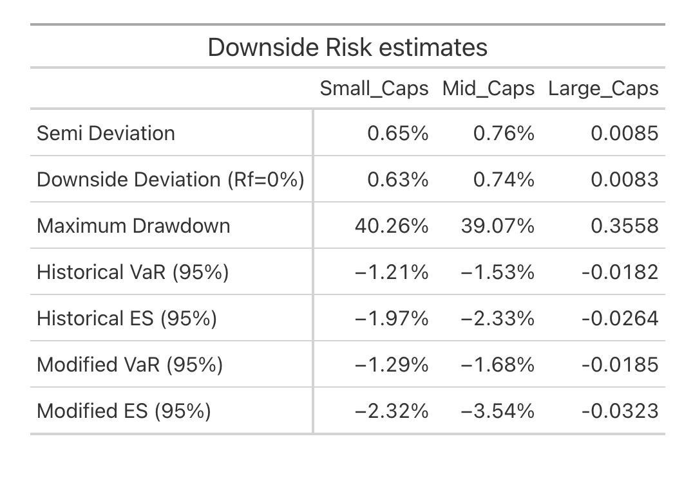
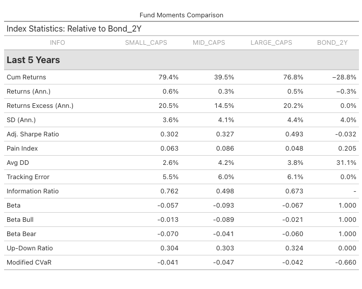

<!-- First: Set your default preferences for chunk options: -->

<!-- If you want a chunk's code to be printed, set echo = TRUE. message = FALSE stops R printing ugly package loading details in your final paper too. I also suggest setting warning = FALSE and checking for warnings in R, else you might find ugly warnings in your paper. -->

```{r setup, include=FALSE}
library(knitr)
knitr::opts_chunk$set(echo = FALSE, message = FALSE, warning = FALSE, fig.width = 6, fig.height = 5, fig.pos="H", fig.pos = 'H')

```


# Introduction \label{Introduction}

This study examines whether smaller stocks exhibit greater stability than larger ones by analysing volatility differences across small, mid, and large-cap stocks listed on the Johannesburg Stock Exchange (JSE). Financial theory suggests that small-cap stocks are typically more volatile due to higher risk exposure, lower liquidity, and greater sensitivity to economic conditions. @jena2021volatility point out that despite the unconditional correlation between these indices, they exhibit very different risk, return and liquidity profiles. Moreover, their findings indicate that in India, large cap stocks offer investors an opportunity for diversification and hedging in the short and long run, respectively. By splitting the JSE All Share Index (J203) into three market cap segments and weighting them by market capitalization, this analysis provides a clearer understanding of how volatility varies across stock sizes.

To measure stability and risk, the study examines rolling 3-year standard deviations, Sharpe ratios, maximum drawdowns, and correlations with the J203 index to assess systematic risk exposure. These metrics provide insight into the risk-return trade-off for each segment and allow for a simple comparison of volatility dynamics. Though limited in scope this research can illuminate the differences in stability across market capitalisation and whether this dimension presents an opportunity for portfolio diversification.


# Data \label{Data}

This analysis utilizes data from the JSE All Share Index (J203), covering daily returns and proportional weights of 99% of JSE-listed stocks from January 1, 2014, to November 29, 2024. Instead of analysing individual stocks, the dataset was aggregated and reweighted based on market capitalization classifications at each point in time. This means that stocks were dynamically grouped into small, mid, and large-cap categories as their market cap evolved over the period. Consequently, the units of observation in this study are the market cap-weighted indices for small, mid, and large-cap stocks, allowing for a structured comparison of their volatility, performance, and risk dynamics over time. Additionally, for comparative purposes, the 2-year South African bond yield is included as a benchmark. However, it is important to note that the last available bond yield data is from March 2022, meaning that all direct comparisons are limited to this period. A summary of the returns data is provided in Table 2.1 below. Notably, small caps exhibit the lowest standard deviation, suggesting relatively lower volatility compared to mid and large caps. Interestingly, the bond yield displays extreme kurtosis and negative skewness, indicating the presence of rare but severe fluctuations, which contrast with the more moderate distribution of equity returns. The results of the comparisons are provided in the next section.


\begin{table}[H]
    \centering
    \caption{Descriptive Statistics for Market Cap Indices and Bond Yields}
    \label{tab:tablestats}
    \begin{tabular}{lcccc}
        \hline
        Statistic & Small Caps & Mid Caps & Large Caps & Bond 2Y \\
        \hline
        Observations & 2061.000 & 2061.000 & 2061.000 & 2061.000 \\
        NAs & 0.000 & 0.000 & 0.000 & 0.000 \\
        Minimum & -0.092 & -0.087 & -0.100 & -0.261 \\
        Quartile 1 & -0.004 & -0.005 & -0.006 & -0.003 \\
        Median & 0.001 & 0.001 & 0.001 & 0.000 \\
        Arithmetic Mean & 0.000 & 0.000 & 0.000 & 0.000 \\
        Geometric Mean & 0.000 & 0.000 & 0.000 & 0.000 \\
        Quartile 3 & 0.005 & 0.006 & 0.007 & 0.003 \\
        Maximum & 0.075 & 0.062 & 0.086 & 0.157 \\
        SE Mean & 0.000 & 0.000 & 0.000 & 0.000 \\
        LCL Mean (0.95) & 0.000 & 0.000 & 0.000 & 0.000 \\
        UCL Mean (0.95) & 0.001 & 0.001 & 0.001 & 0.000 \\
        Variance & 0.000 & 0.000 & 0.000 & 0.000 \\
        Stdev & 0.009 & 0.011 & 0.012 & 0.011 \\
        Skewness & -0.967 & -0.814 & -0.409 & -3.885 \\
        Kurtosis & 19.821 & 9.526 & 7.042 & 207.480 \\
        \hline
    \end{tabular}
\end{table}


# Results

Figure 3.1 presents the cumulative returns of the market cap-weighted indices over the sample period. From 2014 to 2020, the performance of small, mid, and large-cap indices remained relatively similar, with no significant divergence among them. However, following the COVID-19 pandemic and the subsequent market recovery, small-cap stocks demonstrated a clear outperformance compared to mid and large caps. This suggests that, while all segments were impacted by the initial market shock, small caps experienced a stronger post-pandemic rebound, potentially driven by sector-specific recoveries. This divergence highlights the differing market dynamics across capitalization sizes in response to economic shocks and recoveries.

```{r Figure1, warning =  FALSE, fig.align = 'center', fig.cap = "Cumulative Returns by Market Cap Size \\label{Figure1}"}
knitr::include_graphics("plots/cum_plot.pdf")
```

Figure 3.2 illustrates the annualized 3-year rolling returns for the market cap indices. The results reinforce the earlier observation that small-cap stocks often delivered superior returns throughout the majority of the sample period. Unlike cumulative returns, where small caps only began to notably outperform after the COVID-19 recovery, the rolling return data suggests that small caps maintained a persistent performance advantage over mid and large caps for nearly the entire sample range.

This trend highlights the long-term return premium potentially associated with smaller stocks, this could reflect higher growth potential, greater market inefficiencies, or increased risk-taking by investors in certain periods. By the final years of the sample, however,  the rolling returns of large caps began to converge with those of small caps, suggesting a possible stabilization in market dynamics or a shift in investor preference towards larger, more established companies.

```{r Figure2, warning =  FALSE, fig.align = 'center', fig.cap = "Annualized 3-year Rolling Returns By Market Cap Size \\label{Figure2}"}
knitr::include_graphics("plots/ret_plot.pdf")
```

Figure 3.3 presents the annualized 3-year rolling standard deviation for the market cap indices, highlighting a counterintuitive finding: small caps exhibit a consistently lower standard deviation compared to both mid and large caps throughout the sample period. This result challenges conventional financial theory, which typically associates small caps with higher volatility due to their lower liquidity, greater sensitivity to market shocks, and heightened exposure to idiosyncratic risks.

Interestingly, mid and large caps display relatively similar volatility levels for much of the sample, with only small deviations until 2023. After this point, mid caps experience a noticeable decline in standard deviation, bringing their volatility closer to that of small caps, while large caps maintain relatively stable volatility. The relative stability of small caps raises questions about the underlying drivers of their performance and volatility. This finding emphasizes the need for further investigation into the volatility drivers and risk-return tradeoffs within small-cap stocks, as they appear to defy traditional expectations over this sample period.


```{r Figure3, warning =  FALSE, fig.align = 'center', fig.cap = "Annualized 3-year Rolling SD By Market Cap Size \\label{Figure3}"}
knitr::include_graphics("plots/sd_plot.pdf")
```


The table summarises downside risk estimates for small and mid-cap stocks, focusing on metrics that quantify potential losses and tail risks. While results for large caps appear to be incorrect here, the comparison between small and mid caps can still provide meaningful insights. Mid caps consistently exhibit higher risk than small caps, with higher semi-deviation (0.76% vs. 0.65%) and downside deviation (0.74% vs. 0.63%), indicating greater variability and downside exposure during periods of negative returns. Furthermore, mid caps show only a slightly smaller maximum drawdown (39.07%) than small caps (40.26%), suggesting comparable responses during extreme market downturns.

When assessing tail risks using Value at Risk (VaR) and Expected Shortfall (ES), mid caps exhibit the highest downside exposure, with a Historical VaR (95%) of -1.53% and ES of -2.33%, compared to small caps (-1.21% and -1.97%). This pattern persists when adjusting for non-normal return distributions: mid caps have a Modified VaR (95%) of -1.68% and Modified ES (95%) of -3.54%, compared to -1.29% and -2.32% for small caps. These results suggest that mid caps are more vulnerable to extreme downside events, possibly reflecting a greater sensitivity to market shocks or less consistent investor demand relative to small caps.

Overall, small caps exhibit lower overall risk than mid caps across most downside risk measures, with lower deviations, VaR, and ES. However, both categories show significant exposure to extreme tail events, underscoring the inherent risks associated with smaller-cap segments of the market. 

```{r Table1, echo=FALSE, fig.align='center', out.width="80%", fig.cap="Table 1: Risk Measures \\label{tab:Table1}"}


```


Table 2 below provides a 5-year comparative analysis of the performance and risk metrics for small, mid, and large-cap stocks, along with the 2-year South African bond yield (Bond_2Y), although its results appear to be wrong to will be ignored. Over the past five years, small caps have delivered the highest cumulative returns (79.4%), outperforming both large caps (76.8%) and mid caps (39.5%). Small caps also generated the highest excess returns above the benchmark (20.5%), slightly edging out large caps (20.2%). Mid caps lagged significantly, with cumulative returns of 39.5% and excess returns of 14.5%. These results highlight the superior long-term performance of small caps compared to other market segments. The statistics for the 2-year bond yield, however, appear to be incorrect and have been excluded from the analysis.

In terms of risk, large caps exhibited the highest annualized standard deviation (4.4%), followed closely by mid caps (4.1%), while small caps (3.6%) were the least volatile. Despite their higher volatility, large caps delivered the best risk-adjusted performance, as indicated by their superior Adjusted Sharpe Ratio (0.493) compared to mid caps (0.327) and small caps (0.302). Downside risk metrics reveal that mid caps were the most vulnerable, with the largest average drawdown (4.2%) and the highest Modified CVaR (-0.047). Small caps, while maintaining lower volatility, also showed better downside protection, with a lower average drawdown (2.6%) and Modified CVaR (-0.041) compared to mid caps. Large caps demonstrated strong performance on downside metrics also with a moderate drawdown (3.8%) and Modified CVaR (-0.042).

Market sensitivity further distinguishes these indices. Small caps had the highest Information Ratio (0.762), reflecting their superior risk-adjusted excess returns relative to the benchmark, while mid caps trailed with an Information Ratio of 0.498. In bear markets, large caps (-0.060) exhibited greater stability, with a lower downside beta than small caps (-0.070) and mid caps (-0.041). This highlights the ability of large caps to better weather market downturns. Overall, this analysis underscores the strong risk-return trade-off of small caps, the greater vulnerability of mid caps, and the consistent risk-adjusted performance of large caps, offering valuable insights for portfolio diversification and risk management.

```{r Table2, echo=FALSE, fig.align='center', out.width="80%", fig.cap="Table 2: Descriptive Statistics \\label{tab:Table2}"}


```


# Conclusion

This analysis highlights the distinct performance and risk dynamics of small, mid, and large-cap stocks on the Johannesburg Stock Exchange over the past 5 years. Small caps emerged as the strongest performer, delivering superior long-term returns and maintaining relatively moderate volatility. Their consistent outperformance highlights their potential for yielding higher growth, even while exhibiting less downside risks. In contrast, mid caps proved to be the most vulnerable segment, struggling with lower returns and higher exposure to market shocks, as reflected in their risk metrics. 

Large caps demonstrated a balance between return and risk, offering competitive performance while maintaining greater stability during adverse market conditions. They provided strong risk-adjusted returns, emphasizing their appeal to more risk-averse investors. Overall, the findings suggest that small caps are well-suited for those seeking higher growth with manageable risk, while large caps provide a stable and reliable option. These findings challenge the mainstream notion that small caps are inherently more volatile and riskier than their larger counterparts. A deeper investigation is required to better understand the underlying factors driving this unique behaviour in the South African market, such as structural differences, sectoral composition, or local economic dynamics. 


\newpage

# References {-}

<div id="refs"></div>


